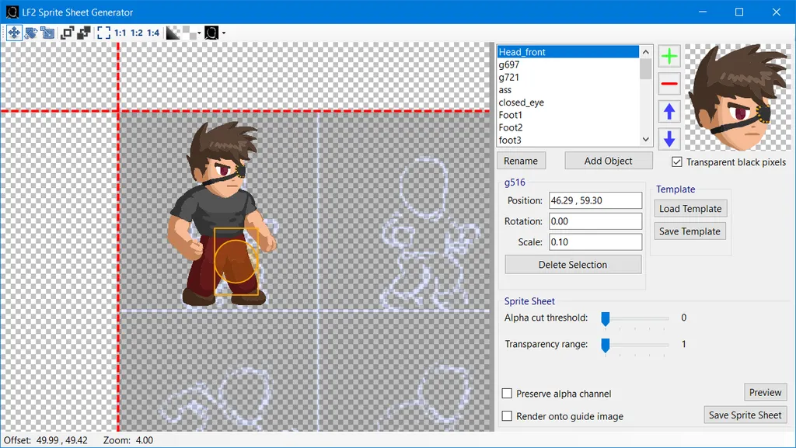
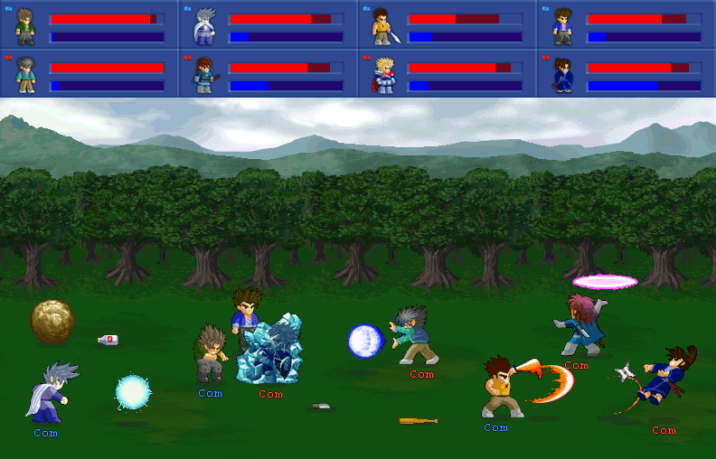

LF2 Sprite Sheet Generator  
   
==========================

This is a graphical .Net Framework v4.6 WinForms application for creating 2D sprite sheets from small sprite parts, mainly aimed at Little Fighter 2. It was also announced on Little Fighter Empire forums in this thread: https://lf-empire.de/forum/showthread.php?tid=10882

LF2 Sprite Sheet Generator has a lot of issues, is no longer updated and not recommended for use. The repository is kept for historical significance and for the unlikely event that I might decide to work on it again.

Getting Started
---------------
1. Add your sprite parts using the green plus `+` button.
2. Add the sprite parts into the sprite sheet by selecting them from the list and pressing `< Add Symbol` button.
3. Place them on the canvas using move/rotate/scale tools to create the sprite sheet you want.
4. You can save the template and also use it with a different sprite set.
5. Press `Save Sprite Sheet` to save the final result as an image file.
6. Enjoy!

Some general tips for usage:
- All object selection is done with left mouse button.
- All object editing/transforming is done with right mouse button.
- Use middle mouse button to scroll and zoom in/out.
- Move, Rotate and Scale tools have G, R, S shortcuts respectively.
- Use [Ctrl + Left mouse button] to select objects additively.
- Use [Shift + Left mouse button] to select objects in an area.
- Ctrl and Shift can be used together to select an area additively.
- It is recommended to use sprites with transparent background (alpha channel).
- In order to reload an existing template and render it, you need to also load sprite parts with the same name, otherwise they will be shown as a (broken image) sprite.

Downloads
---------
Head to [Releases](https://github.com/ahmetsait/LF2-Sprite-Sheet-Generator/releases) section for downloads.

License
-------
LF2 Sprite Sheet Generator is licensed under the [MIT License](LICENSE).

About Little Fighter 2
----------------------
LF2 is a 2D beat 'em up fighting game made by Marti Wong & Starsky Wong. It is extremely customizable with its data file architecture allowing modders to create characters, weapons, levels and even stories from scratch.

  
See the official website: https://lf2.net
